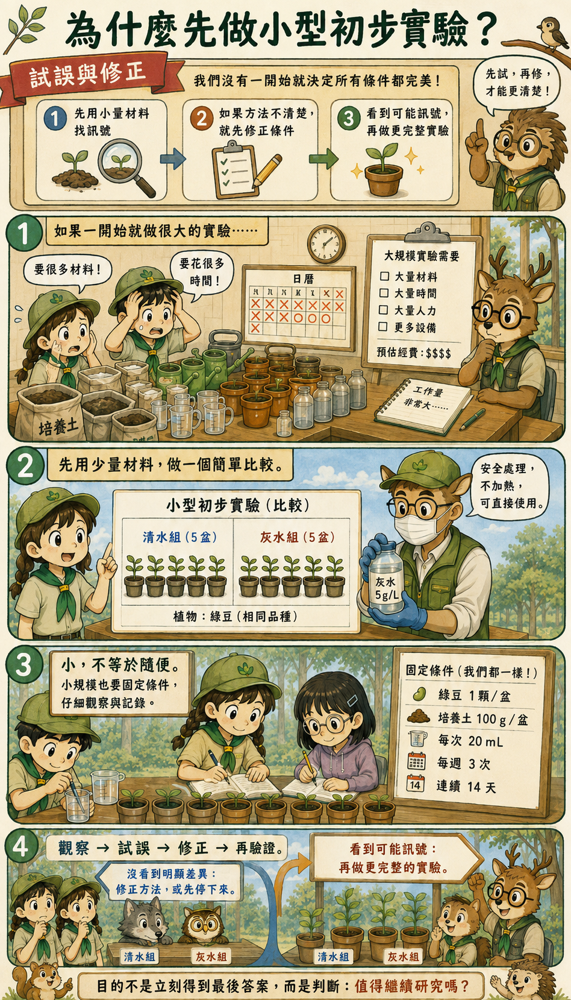
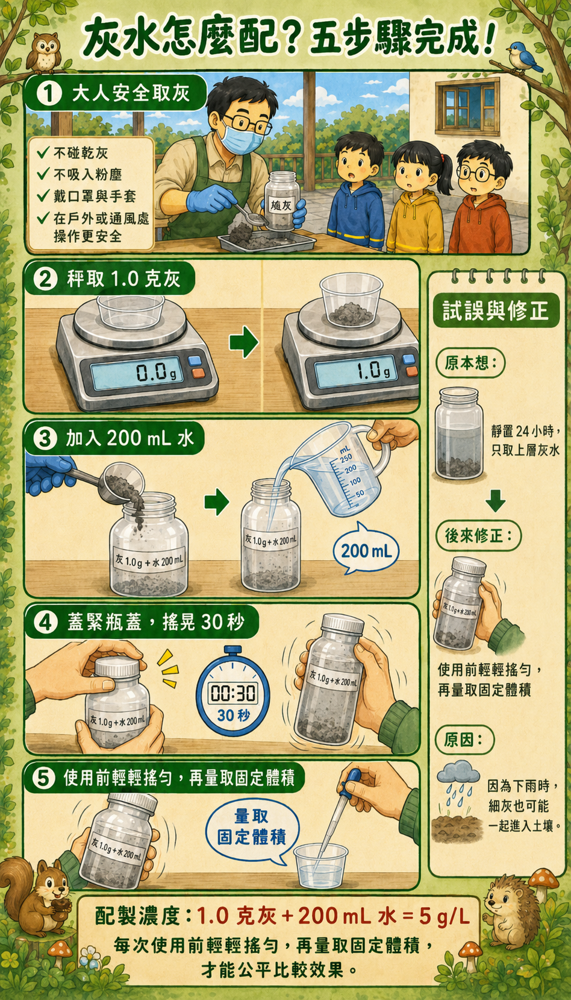
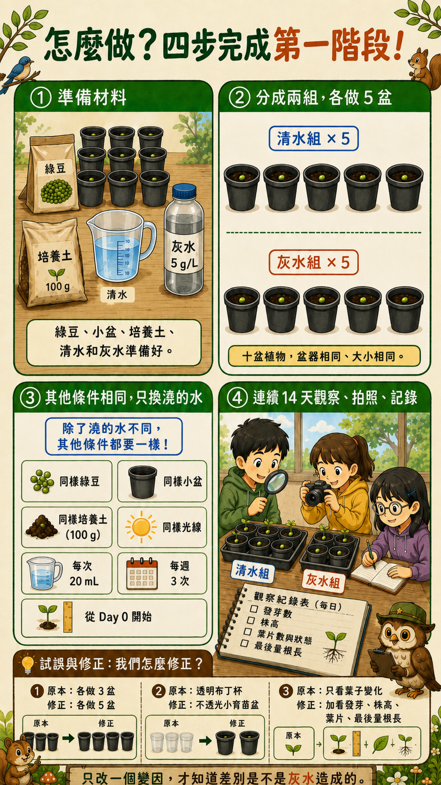
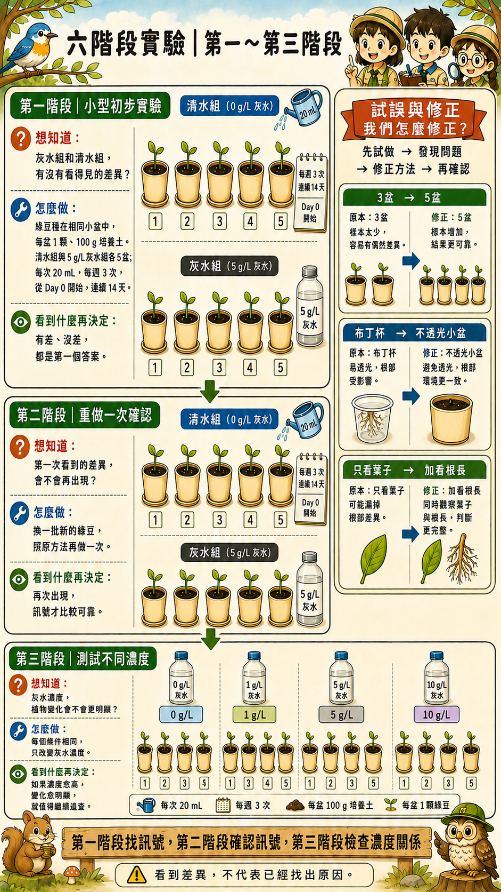

# 🔥 看不見的連鎖殺手

## Invisible Chain Reaction

### 🦌 草原鹿 × 校園公民科學行動

> **我們不知道答案，所以想用實驗一起找答案。**

---

# 🌱 我們想研究什麼？

燒完金紙後，火熄滅了，灰燼卻還在。

灰燼可能被風吹走，也可能遇到雨水，進入土壤或接觸植物。

所以我們想研究：

## **灰燼 → 雨水 → 土壤 → 植物**

這條看不見的環境影響鏈，真的存在嗎？

---

# 🔥 為什麼想做這個研究？

台灣曾發生公墓和墓區周邊的雜草火警。

乾燥又有風時，沒有完全熄滅的火星或紙灰，可能讓小火變成大火。

但是除了火災，我們也好奇：

> **火熄滅後，灰燼還會不會繼續影響環境？**

---

# 🧪 為什麼先做小型初步實驗？

我們沒有一開始就把所有條件都當成已經確定。

先用少量材料做初步比較，可以幫助我們找出問題、修正方法，再決定是否值得進行更完整的實驗。

---

# 💧 灰水怎麼配？

灰燼容易沉澱，也可能黏在瓶壁上。如果只取上層水，每次使用的灰水就可能不一樣。

因此，我們改成在每次取用前輕輕搖勻，再量取固定體積，讓各盆植物接受的處理更公平。

---

# 🌱 第一階段怎麼做？

第一階段先比較清水組與灰水組，其他條件盡量保持一致。

我們也把試做時發現的問題留下來：增加每組盆數、改用不透光小盆，並同時記錄發芽、株高、葉片與根系變化。

---

# 🔬 六階段實驗規畫

第一階段先找訊號，第二階段重新驗證，第三階段再測試不同濃度。

如果真的看見差異，也不能立刻認定一定是灰水造成的；我們還要重複實驗、檢查其他變因，才能逐步接近答案。

---

## 🌏 留住福氣，也照顧土地

**觀察 → 提問 → 試做 → 修正 → 再驗證**

