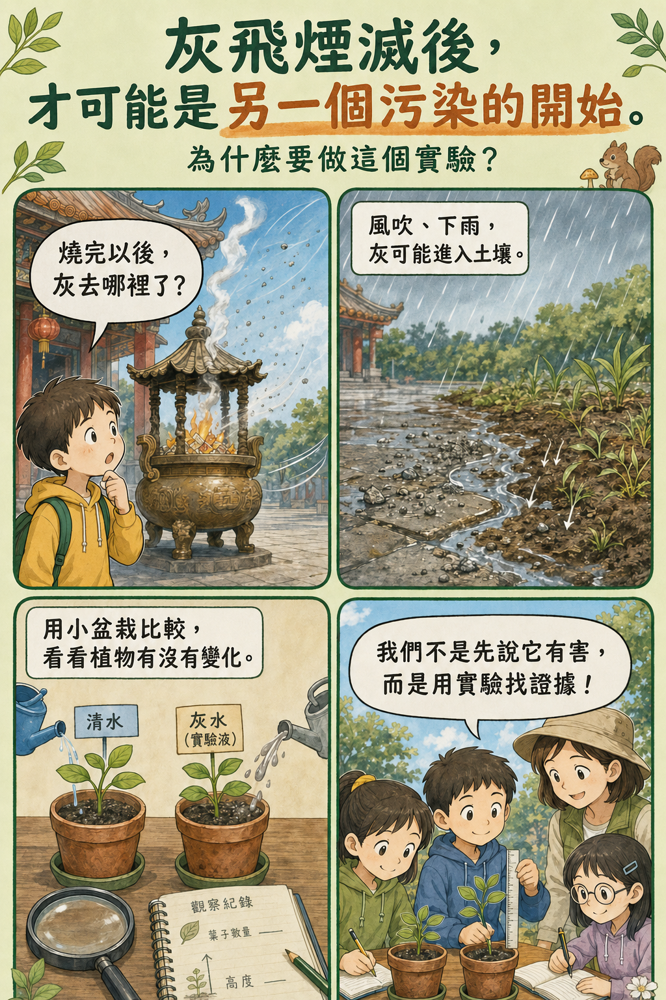
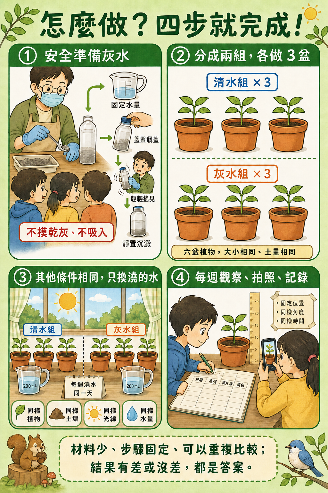
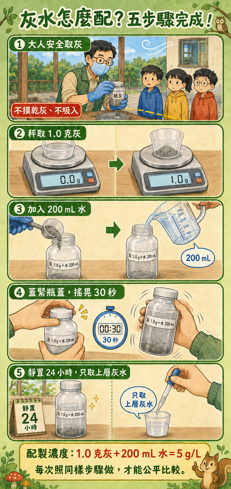
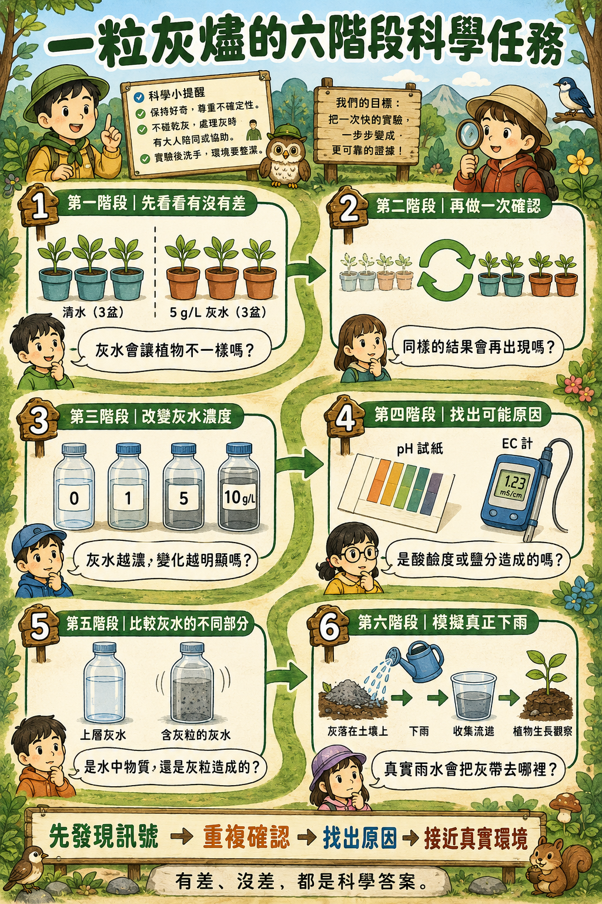
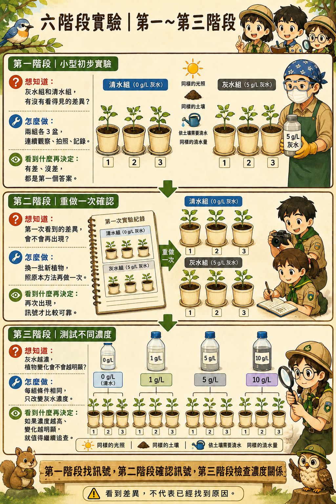
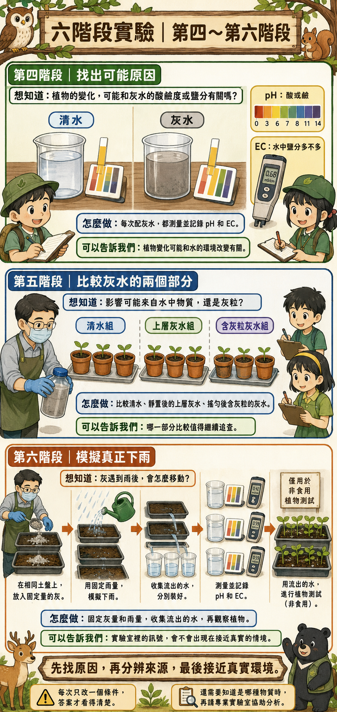
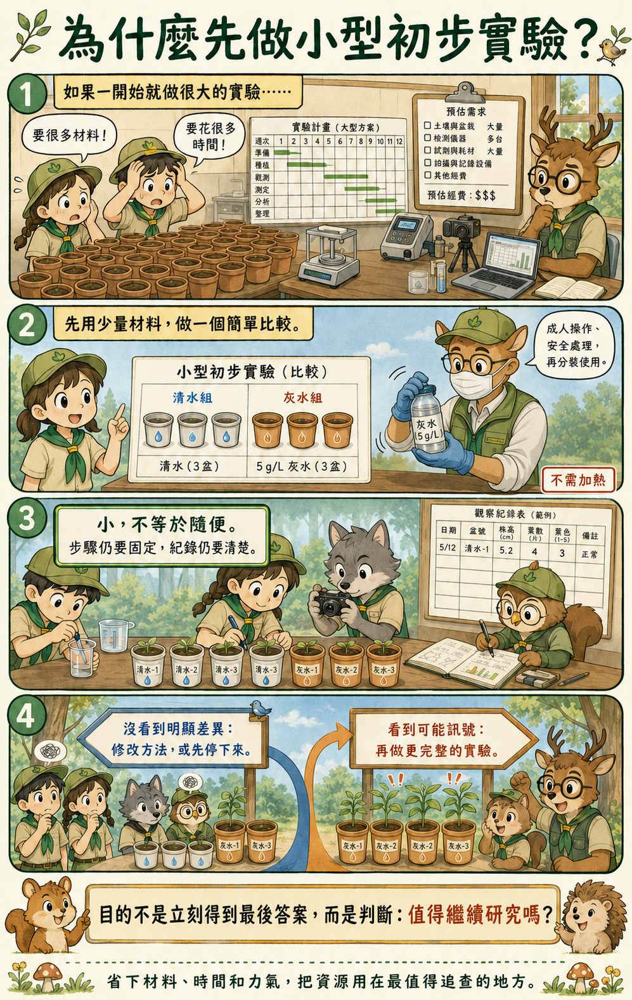

# 🔥 看不見的連鎖殺手

## Invisible Chain Reaction

### 🦌 草原鹿 × 校園公民科學行動

> **我們不知道答案，所以想用實驗一起找答案。**

---

# 🌱 我們想研究什麼？

燒完金紙後，火熄滅了，灰燼卻還在。

灰燼可能被風吹走，也可能遇到雨水，進入土壤或接觸植物。

所以我們想研究：

## **灰燼 → 雨水 → 土壤 → 植物**

這條看不見的環境影響鏈，真的存在嗎？

---

# 🔥 為什麼想做這個研究？

台灣曾發生公墓和墓區周邊的雜草火警。

乾燥又有風時，沒有完全熄滅的火星或紙灰，可能讓小火變成大火。

但是除了火災，我們也好奇：

> **火熄滅後，灰燼還會不會繼續影響環境？**

---

# ❓ 我們的研究問題

1. 灰燼遇到水後，水會發生什麼變化？
2. 用灰水澆植物，植物會不會出現差異？
3. 不同灰水濃度，結果會不會不同？
4. 如果看到差異，再做一次還會出現嗎？
5. 差異可能和酸鹼度、鹽分或灰粒有關嗎？

我們不先說灰燼一定有害，也不把一次結果當成答案。

---

# 🧪 我們怎麼做？

先做一個小型初步實驗：

- 清水組 3 盆
- 5 g/L 灰水組 3 盆
- 使用同樣的植物、土壤、光線和澆水量
- 每週固定拍照、測量和記錄

實驗時盡量只改變一個條件，才知道差異可能從哪裡來。

---

# 💧 灰水怎麼配？

1. 由大人安全取得並處理紙灰。
2. 秤取 1.0 克灰。
3. 加入 200 mL 水。
4. 蓋緊瓶蓋，搖晃 30 秒。
5. 靜置 24 小時，取上層灰水。

這樣配出的濃度是 **5 g/L**。

每次都照同樣步驟做，結果才可以公平比較。

---

# 🗺️ 六階段實驗計畫

| 階段 | 我們要做什麼？ | 想知道什麼？ |
|---|---|---|
| 1 | 小型初步實驗 | 清水組和灰水組有沒有差異？ |
| 2 | 換一批植物重做 | 第一次的結果能不能再次出現？ |
| 3 | 比較不同灰水濃度 | 濃度越高，變化會不會越明顯？ |
| 4 | 測量 pH 和 EC | 差異可能和酸鹼度或鹽分有關嗎？ |
| 5 | 比較上層灰水與含灰粒灰水 | 影響來自水中物質，還是灰粒？ |
| 6 | 模擬真正下雨 | 灰落在土壤後，雨水會把它帶去哪裡？ |

---

# 🔎 為什麼先做小型初步實驗？

如果一開始就做很大的實驗，可能花很多時間和材料，最後才發現方法需要修改。

所以我們先用少量材料測試：

- 方法能不能操作？
- 紀錄表夠不夠清楚？
- 有沒有值得繼續研究的訊號？

沒有明顯差異，也是一個結果。我們可以修改方法，或決定先停下來。

---

# 📝 我們會記錄什麼？

- 植物高度
- 葉片數量
- 葉片顏色與外觀
- 每次澆水量
- 拍照日期與角度
- 灰水的 pH 和 EC
- 實驗中發生的特殊情況

有差、沒差，或和原本猜得不一樣，都要誠實記錄。

---

# 🤝 每個人都可以參加

不用很會做實驗，也能幫忙：

📷 拍照　🌱 照顧植物　📝 做紀錄　📊 整理資料

🎨 畫海報　🎤 分享成果　🔎 提出新問題

---

# 🎯 我們希望完成

- 一份可以追蹤的實驗紀錄
- 一套別人也能重複操作的方法
- 一份孩子看得懂的研究結果
- 一次校園公民科學分享

---

# ⚠️ 安全提醒

- 不直接碰乾灰，也不要吸入灰塵。
- 取灰、秤灰和處理灰燼時，要由大人陪同或協助。
- 實驗後要洗手並整理環境。
- 實驗植物只用來觀察，不能食用。

---

# ❤️ 我們不是要責怪誰

祭祖和祭祀是許多家庭重要的文化。

這個研究不是要否定傳統，也不是先替灰燼下結論。

我們想用觀察和證據了解它，再一起尋找更安全、對環境更友善，也尊重文化的做法。

---

# 📢 我們想分享給誰？

同學、家長、老師和社區。

我們希望先把研究做好，再用問題、資料和對話分享發現。

---

## 🦌 草原鹿 × 校園公民科學

### 一起觀察・一起記錄・一起驗證・一起分享

> **Every discovery begins with one simple question.**

> **每一個重要的發現，都始於一個簡單的問題。**

